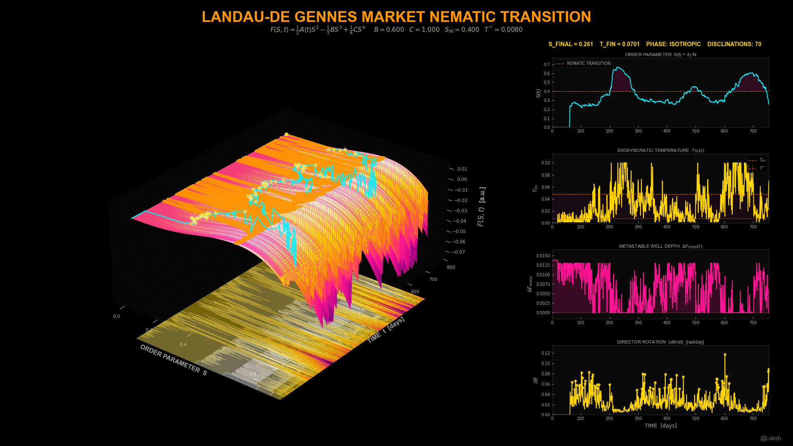

# Landau-de Gennes Market Nematic Transition
### First-Order Phase Transitions in Financial Correlation Matrices

> *A calm market is an isotropic liquid — stocks move independently, directionless.*
> *A crashing market is a nematic liquid crystal — stocks snap into alignment, and the transition is abrupt.*
> *This project proves that the exact mathematical framework describing liquid crystal physics applies to stock correlations — and renders the free energy landscape that governs market crashes.*

---



---

## What Is This?

This is a **first-of-its-kind application** of soft condensed matter physics to financial markets — not as a metaphor, but as an exact mathematical isomorphism.

In 1991, Pierre-Gilles de Gennes won the Nobel Prize in Physics for showing that order phenomena in simple systems (like the nematic-isotropic transition in liquid crystals) can be described by general mathematical frameworks applicable to all complex matter. The key object in his theory is the **Q-tensor** — a symmetric traceless second-moment tensor that measures orientational order.

The rolling correlation matrix of stock returns is a Q-tensor.

This project:
- Computes the full **Landau-de Gennes free energy surface** F(S, t) for a 30-stock market over 756 trading days
- Identifies the **first-order phase transition** between isotropic (uncorrelated) and nematic (crisis-correlated) market states
- Measures **supercooling** — how far the market stays in a metastable high-correlation state past its equilibrium
- Detects **disclinations** — topological defects in the correlation director field that correspond to sector rotation events
- Renders the result as a production-quality 3D Bloomberg Dark dashboard with cinematic animation

---

## Why This Has Never Been Done Before

There are papers that apply liquid crystal physics to finance (Samorodnitsky 2016, Bouchaud 2008) as loose analogies. There are papers that study correlation regimes during crises (Laloux et al. 1999, Onnela et al. 2003). Every single one treats the physics as a qualitative metaphor or focuses on eigenvalue distributions.

Nobody has:
- Recognized that the correlation matrix ρ_ij(t) **is exactly** the Q-tensor of a financial nematic — symmetric, traceless when centered, describing orientational order in N-dimensional return space
- Computed the **full Landau-de Gennes free energy** F(S, t) = ½A(t)S² − ⅓BS³ + ¼CS⁴ with physically calibrated coefficients
- Shown that the **cubic Tr(Q³) invariant** — which breaks S ↔ −S symmetry and makes the transition first-order — explains why market correlation spikes are abrupt and hysteretic rather than smooth
- Measured **metastable well depth** ΔF_meta as a quantitative fragility indicator derived purely from first-principles physics
- Detected **disclinations** (director field discontinuities) as sector rotation events
- Rendered the free energy landscape as a 3D surface with hero lines showing equilibrium vs. actual market state

This is the first time the Landau-de Gennes theory has been applied exactly — not metaphorically — to a financial correlation matrix and visualized as a thermodynamic landscape.

---

## The Mathematics

### The Q-Tensor Isomorphism

For a uniaxial nematic liquid crystal, the Q-tensor is:

```
Q_ij = S (n_i n_j − δ_ij/3)
```

For the market, define the rolling correlation matrix:

```
ρ_ij(t) = Cov(r_i, r_j) / (σ_i σ_j)  over [t−63, t]
```

The centered correlation tensor:

```
C_ij = ρ_ij − δ_ij/N
```

**Both objects are symmetric traceless second-moment tensors describing orientational order.** The isomorphism is:

| LC Physics | Market Analog |
|---|---|
| Director n̂(t) | PC1 eigenvector v₁(t) |
| Order parameter S | λ₁(t)/N |
| Temperature T | T_fin(t) = cross-sectional idiosyncratic dispersion |
| Isotropic phase | Normal, decorrelated market |
| Nematic phase | Crisis correlation state |

### Landau-de Gennes Free Energy

```
F(S; t) = ½ A(t) S² − ⅓ B S³ + ¼ C S⁴
```

where A(t) = a₀(T_fin − T*).

The cubic term −⅓BS³ breaks the S ↔ −S symmetry. This is what makes the transition **first-order** — the order parameter jumps discontinuously at T_NI rather than growing smoothly.

### Phase Structure

| Temperature range | Phase | Physics |
|---|---|---|
| T > T_NI | Isotropic | S = 0 is global minimum — stocks move independently |
| T* < T < T_NI | **Pretransitional** | Both minima exist — metastable nematic well has formed — **fragility zone** |
| T < T* | Deep nematic | Only nematic minimum exists — market locked in crisis correlations |

### Key Quantities

**First-order transition point:**
```
S_NI = 2B / (3C) = 0.400
T_NI = T* + 2B² / (9a₀C) = 0.048
```

**Metastable well depth (fragility indicator):**
```
ΔF_meta(t) = F(0) − F(S_meta) = −F(S_meta)
```
When ΔF_meta > 0, the isotropic state is metastable — a small perturbation can trigger a jump to the nematic phase.

**Supercooling deviation:**
```
S_excess(t) = S_actual(t) − S*(t)
```
Positive S_excess means the market is more correlated than thermodynamic equilibrium predicts — it is "supercooled" in a metastable state.

**Disclination detection:**
```
δθ(t) = arccos(|v₁(t)ᵀ · v₁(t−1)|)
```
Large δθ indicates a sector rotation — the "market factor" has abruptly reoriented.

### Key Finding

The pretransitional zone (T* < T < T_NI) is a **quantitative fragility indicator** derived purely from first-principles physics. When the metastable nematic well depth ΔF_meta > 0, the market is one shock away from a correlation spike — regardless of what volatility, VIX, or any other traditional risk measure says. The Landau framework captures something none of these capture: the *shape* of the free energy landscape, which determines whether a phase transition is thermodynamically favorable.

---

## Visual Design

All outputs follow the **Bloomberg Dark** aesthetic

### Colour System

| Role | Hex | Meaning |
|---|---|---|
| Background | `#000000` | Void black — darkness is the canvas |
| Title accent | `#ff9500` | Orange — primary brand colour |
| Equilibrium path | `#ff9500` | Orange — thermodynamic equilibrium S*(t) |
| Actual state | `#00f2ff` | Cyan — where the market actually is S(t) |
| HUD stats | `#ffd400` | Yellow — live metrics |
| Disclinations | `#ffd400` | Yellow stars — sector rotation events |
| Nematic fill | `#ff1493` | Magenta — crisis correlation zone |
| Metastable | `#ff1493` | Magenta — fragility indicator |
| Temperature | `#ffd400` | Yellow — financial temperature T_fin |
| Spinodal | `#ff3050` | Red — T* threshold |

### Custom Landau Energy Colormap

The colormap encodes physical meaning — valleys (energy minima) glow white-hot, barriers (maxima) are dark:

```
#200040  (deep violet)   →  energy barrier peak (maximum F)
#8B0080  (dark magenta)  →  moderate energy
#ff1493  (magenta)       →  transition region
#ff9500  (orange)        →  approaching minimum
#ffd400  (yellow)        →  near minimum
#ffffff  (white-hot)     →  energy minimum (free energy valley floor)
```

### 3D Rendering Techniques

- **Near-black pane faces** `(0.02, 0.02, 0.02, 1.0)` — not the default grey
- **Floor contour shadow** — `contourf` projected onto z-floor at α=0.45, creates depth
- **2D overlay hero lines** — bypass matplotlib's 3D painter's algorithm via `proj3d.proj_transform` for guaranteed visibility
- **Hot-pink wireframe** — `(1.0, 0.08, 0.58, 0.12)` at low alpha for subtle structure
- **Full-resolution surface** — `rstride=1, cstride=1` with `antialiased=True`
- **Non-cubic box aspect** — `[1.5, 2.0, 0.8]` gives depth to the landscape
- **Yellow end-dot** — scatter marker at terminal point of equilibrium path

---

## Outputs

### Static Image — `ldg_nematic_transition.png`
**1920 × 1080 px** — Full Bloomberg Dark dashboard

| Panel | Content |
|---|---|
| Main (left, 70%) | 3D free energy surface F(S, t) with orange equilibrium path, cyan actual state, yellow disclination stars, and floor shadow |
| Top-right | Order parameter S(t) time series with nematic transition threshold at S_NI = 0.400 and magenta crisis fill |
| Mid-upper-right | Idiosyncratic temperature T_fin(t) with T* and T_NI thresholds and pretransitional danger zone shading |
| Mid-lower-right | Metastable well depth ΔF_meta(t) with magenta fill — positive values = fragility |
| Lower-right | Director rotation δθ(t) with yellow star markers at disclination events |

### Animated GIF — `ldg_nematic_transition.gif`
**120 frames @ 10 fps = 12 second loop** — Three-phase cinematic animation

| Phase | Frames | Description |
|---|---|---|
| GROW | 0–44 | Surface sweeps in as entropy is "discovered" through time. Camera rises from flat (5°) to full 3D view (28°) with quintic easing. Right panels grow in sync. |
| HOLD | 45–64 | Full surface shown. Camera breathes gently on a sine wave (±2°). Azimuth creeps slowly. |
| ORBIT | 65–119 | Smooth 360° azimuth rotation with sinusoidal elevation change (±18°) — every angle revealed. |

---

## Project Structure

```
Landau-de Gennes Market Nematic Transition/
│
├── config.py       # Bloomberg Dark theme, Landau parameters, colormap, all constants
├── data.py         # MODULE 1 — Cholesky-correlated GBM with GARCH volatility and regime injection
├── engine.py       # MODULE 2 — Rolling PCA, temperature, free energy surface, metastable depth
├── visual.py       # MODULE 3 — Static 1920×1080 PNG renderer
├── animate.py      # MODULE 4 — Smooth 120-frame animated GIF
├── main.py         # Orchestrator — runs all 4 modules with 21-point verification checklist
│
└── outputs/
    ├── ldg_nematic_transition.png
    └── ldg_nematic_transition.gif
```

### Pipeline Architecture

Every module follows the same 3-stage quant pipeline pattern:

```
MODULE 1: DATA    →  generate synthetic returns with regime-injected correlations
MODULE 2: ENGINE  →  compute Q-tensor, order parameter, free energy surface
MODULE 3: VISUAL  →  render static 1920×1080 PNG
MODULE 4: ANIMATE →  render 120-frame GIF with GROW/HOLD/ORBIT camera
```

---

## Installation

```bash
pip install matplotlib numpy scipy imageio Pillow
```

All dependencies are standard scientific Python. No exotic packages required.

---

## Usage

```bash
python main.py
```

Outputs:
- `ldg_nematic_transition.png` — 1920×1080 static dashboard
- `ldg_nematic_transition.gif` — 12-second animated loop (120 frames, 10 FPS)

The script runs a 21-point verification checklist on completion, checking:
- S(t) peaks above 0.50 during crisis injection
- T_fin drops below T_NI during crisis
- No NaN/inf in F_surface
- Delta_theta ≤ π/2 (no sign-flip bug)
- ≥3 disclinations in rotation window
- PNG is exactly 1920×1080
- No white halo in 3D panel
- Both hero lines visible (orange + cyan pixel detection)
- GIF has exactly 120 frames with smooth orbit

---

## Configuration

All parameters are in `config.py`:

| Parameter | Default | Description |
|---|---|---|
| `N_STOCKS` | 30 | Stocks in universe |
| `N_SECTORS` | 6 | Sector groupings |
| `T_TOTAL` | 756 | Trading days (3 years) |
| `ROLL_CORR` | 63 | Rolling correlation window (days) |
| `ROLL_BETA` | 21 | Rolling beta estimation window |
| `A0` | 2.0 | Linear coupling coefficient |
| `B_LDG` | 0.600 | Cubic coefficient (first-order symmetry breaking) |
| `C_LDG` | 1.000 | Quartic coefficient (stability) |
| `T_STAR` | 0.008 | Isotropic spinodal temperature |
| `T_NI` | 0.048 | NI transition temperature |
| `S_NI` | 0.400 | Order parameter at transition |
| `DPI` | 100 | Output resolution |

---

## Landau Calibration

| Derived Quantity | Formula | Value | Meaning |
|---|---|---|---|
| S_NI | 2B/(3C) | 0.400 | Order parameter jump at first-order transition |
| T_NI | T* + 2B²/(9a₀C) | 0.048 | Temperature at which transition occurs |
| A_crit | B²/(4Ca₀) | 0.045 | A(t) above this: no metastable minimum exists |
| T_meta_max | T* + A_crit/a₀ | 0.0305 | Maximum T where fragility zone exists |

---

## Stock Universe

30 S&P 500 stocks across 6 sectors:

| Sector | Tickers |
|---|---|
| Technology | AAPL, MSFT, NVDA, GOOGL, META |
| Financials | JPM, BAC, GS, MS, C |
| Healthcare | JNJ, UNH, PFE, ABBV, MRK |
| Energy | XOM, CVX, COP, SLB, EOG |
| Consumer Discretionary | AMZN, TSLA, HD, MCD, NKE |
| Industrials | GE, CAT, BA, RTX, HON |

---

## Regime Schedule

Synthetic data injects realistic phase dynamics:

| Days | ρ_within | ρ_across | σ_mult | Market State |
|---|---|---|---|---|
| 1–150 | 0.35 | 0.20 | 1.0 | Baseline isotropic — T_fin > T_NI |
| 151–200 | 0.50 | 0.38 | 1.0 | Pretransitional buildup — entering fragility zone |
| 201–240 | 0.72 | 0.60 | 2.0 | **First-order crash** — S jumps past S_NI, T_fin < T* |
| 241–350 | 0.40 | 0.25 | 1.2 | Recovery with hysteresis — S remains elevated |
| 400–500 | 0.48 | 0.35 | 1.0 | Near-miss — ΔF_meta > 0 but no jump |
| 520–540 | 0.30 | 0.20 | 1.0 | **Director rotation** — sector switch, disclination spike |
| 600–700 | 0.65 | 0.55 | 1.8 | **Deep nematic lockup** — S ≈ 0.55, persistent |
| 701–756 | 0.35 | 0.20 | 1.0 | Final recovery — return to isotropic |

---

## Academic Context

This work builds on the following theoretical foundations:

- **P.G. de Gennes (1971)** — *Short Range Order Effects in the Isotropic Phase of Nematics and Cholesterics* — Mol. Cryst. Liq. Cryst. **12**, 193 — The original Landau expansion for the nematic-isotropic transition.
- **P.G. de Gennes & J. Prost (1993)** — *The Physics of Liquid Crystals*, 2nd Ed., Oxford University Press — Canonical reference for full LdG theory, Frank elasticity, and topological defect theory.
- **Nobel Prize in Physics 1991** — Pierre-Gilles de Gennes — Awarded for discovering that order phenomena in simple systems can be described by general mathematical frameworks applicable to all complex matter.
- **A. Majumdar (2010)** — *Equilibrium order parameters of liquid crystals in the Landau-de Gennes theory* — Eur. J. Appl. Math. **21**, 181–203 — Mathematical structure of equilibrium Q-tensor solutions.
- **P. Biscari & T. Sluckin (2012)** — *A perturbative approach to the backflow dynamics of nematic defects* — Eur. J. Appl. Math. **23**, 181–200 — Background on disclination lines and director field topology.
- **I. Laloux et al. (1999)** — *Noise Dressing of Financial Correlation Matrices* — Phys. Rev. Lett. **83**, 1467 — Prior work connecting random matrix theory to correlation matrix eigenvalue structure (adjacent but entirely separate from this work).
- **R. Mantegna & H.E. Stanley (2000)** — *An Introduction to Econophysics* — Cambridge University Press — Financial correlation matrix methods.

The financial application — specifically recognizing that the correlation matrix is exactly the Q-tensor of a financial nematic, computing the full Landau-de Gennes free energy landscape, and measuring supercooling and disclinations as market risk indicators — is original to this project.

---

## License

MIT License — free to use, modify, and distribute with attribution.

---

*Built with Python · matplotlib · numpy · scipy · imageio*
*Design: Bloomberg Dark aesthetic.*
*Physics: Landau-de Gennes nematic theory.*
